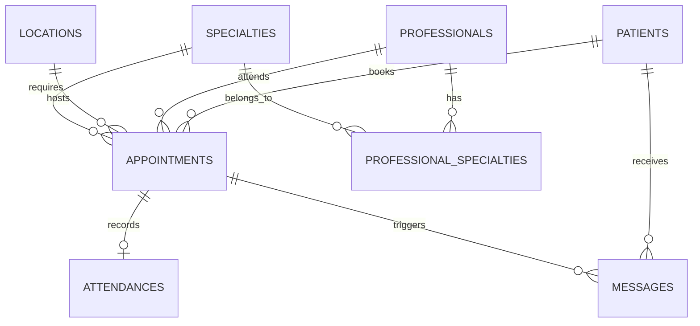

# Modelo de Datos Operacional - ClínicaRed

## Diagrama Entidad-Relación (ERD)

```mermaid
erDiagram
    PATIENTS ||--o{ APPOINTMENTS : "books"
    PATIENTS ||--o{ MESSAGES : "receives"
    PROFESSIONALS ||--o{ APPOINTMENTS : "attends"
    PROFESSIONALS ||--o{ PROFESSIONAL_SPECIALTIES : "has"
    SPECIALTIES ||--o{ PROFESSIONAL_SPECIALTIES : "belongs_to"
    LOCATIONS ||--o{ APPOINTMENTS : "hosts"
    SPECIALTIES ||--o{ APPOINTMENTS : "requires"
    
    APPOINTMENTS ||--o| ATTENDANCES : "records"
    APPOINTMENTS ||--o{ MESSAGES : "triggers"
```